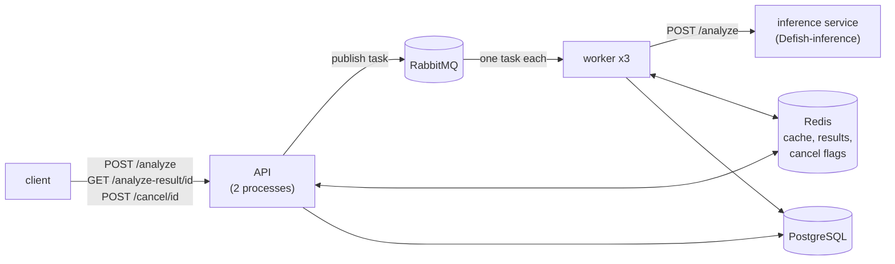
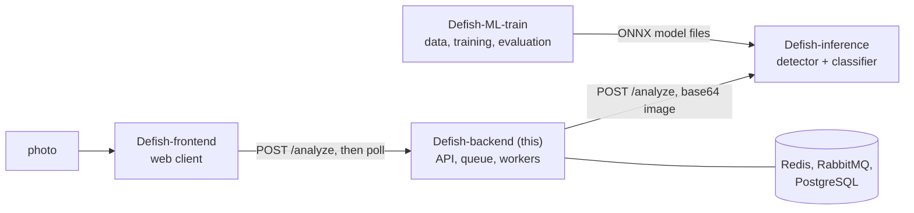

# Defish API

Backend of the [**Defish**](https://defish.katzer.ru/) demo: a user uploads a photo of an aquarium and gets back the detected fish, a diagnosis for each and care advice. It sits between a web client and the model service, queues the work, answers repeated photos from a cache, handles cancellation and keeps a record of every analysis.

> **Not a veterinary tool.** The classes and advice are hints from a small model, and the recommendations are general guidance.

What a client sees (real output from the stack in this repository; the inference service is replaced by a **mock**, so the classes and confidences are canned, and the long fields are shortened with `...`):

```console
$ curl -s -F image=@aquarium-synthetic.jpg http://127.0.0.1:8001/analyze
{"task_id":"857ef143-ed65-4a1d-aa2b-b469330cc91a","cached":false,"message":"Task submitted successfully","result":null}

$ curl -s http://127.0.0.1:8001/analyze-result/857ef143-ed65-4a1d-aa2b-b469330cc91a
{ "id": "84", "diagnosis": "mycobacteriosis, hexamitosis", "confidence": 0.735,
  "recommendations": "Mycobacteriosis (fish tuberculosis). ...", "original_image": "/9j/4AAQSkZJRgABAQAA...",
  "image_width": 640, "image_height": 480,
  "detections": [ { "x_min": 253, "y_min": 55, "x_max": 417, "y_max": 128, "classification_class": "mycobacteriosis",
                    "classification_confidence": 0.58, "detection_confidence": 0.62, "uncertain": true, "top3": [...], ... }, ... ] }

$ curl -s -F image=@aquarium-synthetic.jpg http://127.0.0.1:8001/analyze      # the same photo again: no task, answered from the cache
{"id":"85","diagnosis":"mycobacteriosis, hexamitosis","confidence":0.735,"detections":2,"task_id":null}      # (shortened with jq)
```

The full session, including a failed task, a canceled one and a photo without fish, is in [docs/examples/transcripts/walkthrough.txt](docs/examples/transcripts/walkthrough.txt).

## What this project demonstrates

- **A request that does not wait for the models.** `POST /analyze` returns a task id at once; RabbitMQ and three workers do the slow part; the client polls. A repeated photo is answered in one request from Redis, with no task at all. [Why](docs/design-decisions.md#1-answer-with-a-task-id-and-let-the-client-poll)
- **Failure handling that was tested by breaking things.** After `docker compose restart rabbitmq` the three workers reconnected within 15 s and processed the next task; `docker compose stop` during an 8 s analysis took 6 s, exited with status 0 and the result was stored. Before the fixes the workers exited and stayed down. [Details](docs/design-decisions.md#10-the-worker-reconnects-and-stops-gracefully)
- **Defects found by running the stack, then fixed and measured.** 20 orphan reply queues and 20 stale files per 20 photos, a photo written into a text column (614,880 characters over 20 rows), a start-up race that killed a server process, a detection score that was always 0.0. [Before/after table](#results-measured-behaviour)
- **64 tests in about 10 s, no Docker needed** (fake Redis, SQLite, a mocked broker and inference service; one migration test on a real PostgreSQL). [Tests](#tests-and-quality)
- **Honest about what it lacks:** no authentication; **3 MB photos are still too much when ten arrive at once** (API processes hit their 200 MB limit, measured); no retries; never run against the real model service. See [Limitations](#limitations).

## Contents

[Idea](#idea) · [Features](#features) · [How it works](#how-it-works) · [Results: measured behaviour](#results-measured-behaviour) · [Quick start](#quick-start) · [Usage examples](#usage-examples) · [Configuration](#configuration) · [API](#api) · [Repository layout](#repository-layout) · [Tests and quality](#tests-and-quality) · [Deployment](#deployment) · [Limitations](#limitations) · [Related repositories](#related-repositories) · [License and credits](#license-and-credits)

Further reading in `docs/`:

| File | What is there |
|---|---|
| [docs/architecture.md](docs/architecture.md) | component diagram, one analysis as a sequence, message format, Redis keys, data model (ER), timeouts, what happens when each part fails |
| [docs/design-decisions.md](docs/design-decisions.md) | fifteen decisions with what came before, the measurements behind the fixes, and what was considered and not done |
| [docs/api.md](docs/api.md) | every route with real requests, responses and error cases; the contract with the inference service |
| [docs/deployment.md](docs/deployment.md) | services and limits, start-up sequence, full settings table, operating commands, Alembic, upgrade notes, what was verified |
| [docs/examples/](docs/examples/) | mock inference service, synthetic photo, compose override, walkthrough script, recorded transcripts |

## Idea

An analysis of an aquarium photo takes seconds: the inference service finds every fish and classifies each crop. A demo that holds the HTTP request open for that long breaks behind a proxy, loses the work when the user closes the tab and cannot show anything while waiting.
This API separates the three concerns:

1. **Accepting a photo is cheap and immediate.** The API hashes the bytes, looks the photo up in Redis and either answers or publishes a task. The photo travels inside the task, so workers need no shared disk.
2. **Doing the analysis is somebody else's job.** Workers pick one task at a time, call the inference service, convert the answer, store it and acknowledge. Results go back through Redis, which is also the only thing the API reads while the client polls.
3. **Changing one's mind is a flag.** Cancel sets a key that the worker checks before and after the slow call and before it commits, so a canceled task leaves nothing in the database.

The interesting engineering is in the unglamorous parts: what happens when the broker restarts, when a worker is stopped mid-task, when two server processes start on an empty database, and what a canceled or failed task leaves behind. Those are the subject of the measurements below.

## Features

**Upload and analysis**
- Asynchronous analysis: `POST /analyze` answers `{task_id, cached: false, ...}`; `GET /analyze-result/{task_id}` answers `processing`, `failed`, `canceled` or the result. [Code](main.py), [reference](docs/api.md)
- Cache by photo content: the same bytes within the cache lifetime (default one hour) are answered at once with the finished analysis and no task. [Why](docs/design-decisions.md#4-the-cache-is-keyed-by-the-bytes-of-the-photo)
- One entry per detected fish: box in pixels of the original, detector score, class, class confidence, the inference service's `uncertain` flag and `top3`, and care advice for the class. [Code](worker.py) (`parse_detection`), [test](tests/test_worker.py)
- Uploads over `MAX_UPLOAD_MB` (default 10) are refused with `413` before anything is queued; the photo is kept once in Redis (`photo:{md5}`), results and cache entries hold only the analysis. [Why](docs/design-decisions.md#14-the-photo-has-its-own-redis-key-and-uploads-have-a-size-limit)
- One summary per photo: the classes joined, the mean confidence and one advice text per distinct class (diseases first; the `healthy` text only when no fish is sick). A photo without fish gets a "no fish found, take a clearer photo" text instead of "the fish is healthy". [Code](utils/recommendations.py), [tests](tests/test_recommendations.py)

**Control**
- Cancellation with `POST /cancel/{task_id}`; three checks in the worker; nothing stored for a canceled task. [Why](docs/design-decisions.md#6-cancellation-is-a-flag-checked-three-times)
- A failed task reports a short reason (`ML service unavailable`, `ML service timed out`, `ML service returned HTTP 500`, `Internal error`) and never an exception text or an address. [Why](docs/design-decisions.md#9-the-client-sees-short-error-texts-not-exceptions)
- Every upload is recorded: `users` (by client address), `fish_analyses`, `detections`. [Data model](docs/architecture.md#data-model)

**Operations**
- `docker-compose.yml`: PostgreSQL, Redis, RabbitMQ, the API (two server processes) and three workers, with memory and CPU limits, health checks and restart policies. [Deployment](docs/deployment.md)
- Workers reconnect to the broker and stop gracefully on SIGTERM. [Why](docs/design-decisions.md#10-the-worker-reconnects-and-stops-gracefully)
- `prestart.py` creates the tables once, before the API starts; an Alembic baseline is available. [Why](docs/design-decisions.md#11-tables-are-created-before-the-api-starts-alembic-holds-a-baseline)
- `GET /handshake` (is the inference service up), `GET /cache-stats`, `GET /clear-cache`, interactive docs at `/docs`.

**For development**
- A mock inference service with the real contract and switches by file name (`slow`, `broken`, `empty`), a synthetic test photo, a compose override and a walkthrough script that replays every scenario. [examples](docs/examples/)

## How it works



One analysis, from upload to result, as a sequence, the message format and the Redis keys are in [docs/architecture.md](docs/architecture.md). The decisions in one line each:

| Decision | Reason |
|---|---|
| answer with a task id, client polls | no long-held requests; works with plain `curl` |
| task queue and separate workers | the slow part scales and restarts independently of the API |
| result through Redis, not a reply queue | the reply queues were never read and piled up in the broker ([measured](#results-measured-behaviour)) |
| cache keyed by the photo's bytes | users re-upload the same photo; each analysis costs the inference service real time |
| acknowledge always, never retry | failures are mostly deterministic for the input; a requeue loop would block a worker |
| cancel is a flag, checked three times | the only thing both processes can see; the inference call itself cannot be aborted |
| one transaction per analysis | a canceled task must not leave a half-written analysis |
| photo in the message and once in Redis under its own key, never on disk or in a table column | the worker is another container and cannot see the API's disk |

Not done, on purpose or for lack of time: authentication, retries and a dead-letter queue, upload validation, a result store separate from the cache ([list and reasons](docs/design-decisions.md#considered-and-not-done)).

## Results: measured behaviour

The checks that matter for this service are about behaviour under failure and load, not about accuracy (that belongs to the models, see [Defish-ML-train](#related-repositories)). The same scenarios were run against the code as it was before the fixes (commit `2516efb`) and against the current code, each on empty volumes,
on one Linux machine with Docker 29.8.1. **The inference service was the mock** and the photos were a 23 KB synthetic picture (each submission with random trailing bytes, so every hash was new) and, for the stress run, 3 MB variants of it.
Every figure is a single run; raw output: [docs/examples/transcripts/fixes-before-after.txt](docs/examples/transcripts/fixes-before-after.txt).

| Scenario (20 photos, 3 workers) | Before | After |
|---|---|---|
| start-up on an empty database | `UniqueViolation` in the API log, one server process died and was replaced | no error |
| RabbitMQ queues left behind after the run | 20 queues `result_<uuid>`, 1 message each, 0 consumers (690,966 bytes) | none (only `fish_analysis_queue`) |
| `/tmp/fish_*` files in the API container | 20 (the workers, in other containers, could not delete them) | 0 |
| `fish_analyses.processed_image_path`, 20 rows | 614,880 characters (the photo as base64), table 720 kB | `NULL`, table 48 kB |
| detector score stored in `detections` (39 and 37 rows) | min 0, max 0 | min 0.6, max 0.98 |
| `docker compose restart rabbitmq` | the 3 workers `Exited (0)` and never came back; the next task was never processed | all 3 reconnected, 15 s, next task processed |
| cancel arriving while rows are written (unit-level run, SQLite) | 1 orphan `fish_analyses` row, 0 detections | nothing stored |
| `docker compose stop` during an 8 s analysis | not measured on the old code | stopped after 6 s, exit status 0, result stored |
| 3 runs in a row of 50 photos of 3 MB (see below) | RabbitMQ at 0.26 of its 0.3 GB, then restarted; the 3 workers exited; later runs delivered 0 results | all services stayed up in every run |

**Large photos, measured.** An analysis used to keep the photo as base64 twice in Redis (in the cache entry and in the result), and the API reads each upload completely into memory (container limit 200 MB; Redis limit 64 MB with `allkeys-lru`).
The photo now lives once under its own key (4.2 MB for a 3 MB photo), the result and the cache entry are about 6 KB each, and uploads over `MAX_UPLOAD_MB` (10) get `413`. Runs of 50 photos of about 3 MB, raw output in [docs/examples/transcripts/stress-large-photos.txt](docs/examples/transcripts/stress-large-photos.txt):

| Code and client | Delivered of 50, per run | Uploads that failed, per run | What else |
|---|---|---|---|
| old code, runs in a row on one stack | first stack 40, 5, 0 (worst-case client) then 0, 0, 0 (web-client-like); second stack 10, 7, 0 | up to 24 | the unread reply queues took RabbitMQ to 0.26 of its 0.3 GB, it restarted, the workers exited and stayed down |
| photo inside every Redis value, web-client-like (10 concurrent clients, polling every second) | 50, 41, 44, 35, 40 | 0, 7, 0, 14, 1 | 1 to 9 accepted uploads per run never got a result (evicted) |
| photo under its own key, size limit, web-client-like | 32, 41, 50 | 18, 9, 0 | no accepted upload lost its result; an out-of-memory kill in the API container was flagged in every run |
| photo under its own key, size limit, worst-case client (submit all, then poll) | 12, 10 | 0, 0 | results of the first tasks were evicted by the photos that arrived later |

So the fixes did not make large photos worse (the old code stopped working altogether after a few runs, the current one stays up), and moving the photo out of the values removed the lost results for clients that poll as the web client does.
Two weak spots remain and are measured, not fixed: with 10 concurrent uploads of 3 MB the 200 MB of the API container run out (each upload is held in memory several times: read, base64, JSON, frame), so some uploads fail; and Redis' LRU does not tell a 6 KB result from a 4 MB photo, so a client that polls late can lose the result of an early task.
Not tried yet: a cap on concurrent in-memory uploads, and evicting photos before results (a shorter lifetime for `photo:*` with `volatile-ttl`).
With the 23 KB photos of the table above none of this appears (20 of 20 delivered).

At idle the stack used about 0.5 GB; the API container sat at 154 of its 200 MiB ([docs/examples/transcripts/stack-checks.txt](docs/examples/transcripts/stack-checks.txt)).
Nothing here is a benchmark of throughput or latency: with the mock an analysis takes milliseconds, and with the real service the time is the model's.

## Quick start

Requirements: Python 3.11 or newer with [uv](https://docs.astral.sh/uv/) for the tests (the image uses 3.11; the tests were run on 3.12); Docker with Compose v2 for the stack. Verified on Linux with Python 3.12, Docker 29.8.1 and Compose 5.5.1.

**1. Tests, no Docker** (64 tests, about 10 s):

```bash
git clone https://github.com/GKatzer/Defish-backend.git && cd Defish-backend
uv venv .venv && uv pip install -p .venv -r requirements-dev.txt
.venv/bin/python -m pytest -q
```

**2. The whole stack with the mock inference service** (needs no model weights):

```bash
cat > .env <<'EOF'
ML_SERVER_URL=http://ml:8000
POSTGRES_USER=fishuser
POSTGRES_PASSWORD=CHANGE_ME
POSTGRES_DB=fishguard
EOF
docker compose -f docker-compose.yml -f docs/examples/docker-compose.mock-ml.yml up -d --build
curl -s http://127.0.0.1:8001/handshake
bash docs/examples/walkthrough.sh          # upload, poll, cache hit, no fish, failure, cancel, unknown id
```

The API listens on `127.0.0.1:8001`. `docker compose down -v` removes everything. The photo the walkthrough uploads is [docs/examples/aquarium-synthetic.jpg](docs/examples/aquarium-synthetic.jpg), drawn by a script, not a photograph.

**3. With the real inference service.** *Not run for this documentation (no weights were available).* Put its address in `.env` as `ML_SERVER_URL` and start with `docker compose up -d --build`. The service is [`Defish-inference`](#related-repositories); it needs the model files described in its README.

## Usage examples

All outputs are from the stack above, recorded on 2026-10-04 with the mock; ids differ on every run.

A photo without fish (the mock's `empty` switch) gets its own text, not "the fish is healthy":

```console
$ curl -s http://127.0.0.1:8001/analyze-result/6f373375-0ec7-412f-8efe-043141a113ad
{"id": "86", "diagnosis": "No objects detected", "confidence": 0.0, "detections": [], ...,
 "recommendations": "No fish was found in the photo. Take a sharper picture in good light so that the whole fish is visible."}
```

The inference service fails (`broken`) and the client is told why, without an address:

```console
$ curl -s http://127.0.0.1:8001/analyze-result/a9d31efd-8f20-48ed-b2c4-824c722b2710
{"status":"failed","message":"ML service returned HTTP 500","task_id":"a9d31efd-8f20-48ed-b2c4-824c722b2710"}
```

Cancel a slow analysis (`slow`, 8 s in the mock):

```console
$ curl -s -X POST http://127.0.0.1:8001/cancel/e8eafb5c-0857-438d-b773-1960c134440a
{"status":"canceled"}
$ curl -s http://127.0.0.1:8001/analyze-result/e8eafb5c-0857-438d-b773-1960c134440a
{"status":"canceled","message":"Analysis canceled by user","task_id":"e8eafb5c-0857-438d-b773-1960c134440a"}
```

An id nobody issued is indistinguishable from a running task, and the API accepts any file (error cases in [docs/examples/transcripts/error-cases.txt](docs/examples/transcripts/error-cases.txt)):

```console
$ curl -s http://127.0.0.1:8001/analyze-result/00000000-0000-0000-0000-000000000000
{"status":"processing","message":"Image analysis is still in progress","task_id":"00000000-0000-0000-0000-000000000000"}
```

## Configuration

Settings are environment variables, read from `.env` by docker-compose. Details, the services that read each one and upgrade notes: [docs/deployment.md](docs/deployment.md#configuration). Checked against the code with `grep -rn getenv`.

| Variable | Meaning | Default | Required |
|---|---|---|---|
| `ML_SERVER_URL` | base address of the inference service, `host:port` or `http://host:port`, no path | none (the process stops without it) | yes |
| `POSTGRES_USER`, `POSTGRES_PASSWORD`, `POSTGRES_DB` | database credentials; compose builds the connection URL from them | none | yes (compose) |
| `DATABASE_URL_INT` | full SQLAlchemy URL; wins over `DATABASE_URL` and over the URL built by compose | built by compose | no |
| `DATABASE_URL` | fallback for `DATABASE_URL_INT` | none | no |
| `REDIS_URL` | `redis://host:port` | `redis://redis:6379` (set by compose) | no |
| `CACHE_SAVING_TIME` | lifetime of a cached analysis, seconds | `3600` | no |
| `MAX_UPLOAD_MB` | largest accepted upload, MB; larger files get `413` | `10` | no |
| `RABBITMQ_HOST`, `RABBITMQ_PORT` | broker address | `rabbitmq`, `5672` (set by compose) | no |
| `RABBITMQ_USERNAME`, `RABBITMQ_PASSWORD` | broker credentials, also used to create the broker's user | `guest` / `guest` | no, change them |

## API

Summary; parameters, real responses and error cases are in [docs/api.md](docs/api.md). Interactive documentation at `/docs`.

| Endpoint | Description |
|---|---|
| `POST /analyze` | multipart upload (`image`); returns `{task_id, cached, message}`, or the finished result directly on a cache hit |
| `GET /analyze-result/{task_id}` | `processing`, `failed`, `canceled`, or the result: diagnosis, confidence, advice, the photo, one entry per fish |
| `POST /cancel/{task_id}` | cancel a task (always answers `canceled`, also for unknown ids) |
| `GET /handshake` | ask the inference service for its health |
| `GET /cache-stats`, `GET /clear-cache` | number of cached analyses and Redis memory; delete all cached analyses (unprotected, see Limitations) |
| `GET /` | liveness |

## Repository layout

```
main.py                    API: upload, polling, cancel, cache endpoints
worker.py                  queue consumer: calls the inference service, converts and stores results, reconnects, stops gracefully
config.py                  settings from the environment (ML_SERVER_URL, REDIS_URL, cache lifetime)
database.py                SQLAlchemy engine and session; DATABASE_URL_INT / DATABASE_URL
prestart.py                runs before the API: waits for the database, creates the tables
models/models.py           tables (users, fish_analyses, detections) and response models
rabbitmq/                  async publisher used by the API (rabbitmq_client.py), task and result schemas (schemas.py)
utils/cache.py             Redis client factory and a cache wrapper that never raises
utils/recommendations.py   care advice per class and the summary for a photo
alembic/, alembic.ini      baseline migration 0001; env.py uses the application's database URL
tests/                     64 tests, no Docker needed (see Tests and quality)
docs/                      architecture, design decisions, API, deployment
docs/examples/             mock inference service, synthetic photo, compose override, walkthrough, transcripts
Dockerfile, docker-compose.yml, env-example.txt
requirements.txt, requirements-dev.txt, pytest.ini, logging.yaml, LICENSE
```

About 1,300 lines of Python in the application and 1,000 in the tests, outside migrations.

## Tests and quality

```bash
.venv/bin/python -m pytest -q        # 64 passed in about 10 s
```

| File | Tests | What it covers |
|---|---|---|
| `tests/test_api.py` | 21 | upload, task and cache-hit answers, user per address, queue failures, polling states and their priority, cancel, the size limit and the photo key (also when the photo is gone), handshake, cache endpoints, a worker result served by the API |
| `tests/test_worker.py` | 12 | result, cache and database rows, field mapping, no-fish text, ML errors without details, cancel before, during and after the rows are written, files are not deleted |
| `tests/test_worker_loop.py` | 7 | reconnect after a broker drop, retry while unreachable, SIGTERM, acknowledgement rules (failed task acked, malformed message dropped, reply for old tasks) |
| `tests/test_recommendations.py` | 9 | advice lookup, keyword fallback, summary rules |
| `tests/test_config.py` | 9 | settings in fresh interpreters: URL normalisation, missing `ML_SERVER_URL`, lifetimes, database URL precedence |
| `tests/test_rabbitmq_client.py` | 3 | one persistent message, no reply queue, failures return `None` |
| `tests/test_startup.py` | 3 | `prestart.py` in a fresh process, column repair, Alembic baseline on a real PostgreSQL (needs `pgserver`, skipped without it) |

Redis is replaced by `fakeredis`, the database by SQLite, the broker and the inference service by fakes; only the migration test uses a real PostgreSQL. Fifteen deliberate regressions (old field name, early commit, deleting files again, leaking exception texts, the photo back inside the result, no size limit, and so on) were each caught by a failing test; this was done by hand, not by a mutation-testing tool.

Not covered: a real RabbitMQ or Redis in the tests (the Docker runs above cover that by hand), load and latency, the real inference service. No linter configuration and no CI exist in this repository; no workflow has run on GitHub.

## Deployment

Five containers on one bridge network (PostgreSQL, Redis, RabbitMQ, the API with two server processes, three workers) with memory and CPU limits (200 to 300 MB each); only the API is published, on `127.0.0.1:8001`. Start-up runs `prestart.py` (tables), then uvicorn; workers wait for the broker and Redis.
The inference service is outside this compose file. A reverse proxy for public access is not part of the repository. Details, operating commands and upgrade notes: [docs/deployment.md](docs/deployment.md).

## Limitations

- **No authentication.** CORS is open (`*`), the API trusts `X-Forwarded-For` as sent (a request with `X-Forwarded-For: 203.0.113.7` created a user with that address, measured), and `GET /clear-cache` (a `GET` that deletes) and `GET /cache-stats` (uses `KEYS`) are open. Suitable for a demo on a private network, not for the public internet.
- **Large photos still fail under concurrency.** With 10 concurrent uploads of 3 MB the API container (200 MB) loses processes to the memory limit: 18, 9 and 0 of 50 uploads failed in the last three runs. Uploads over 10 MB are refused (`413`, configurable); the number of concurrent uploads is not limited.
- **Redis can still drop results.** With a 64 MB limit and `allkeys-lru`, 4 MB photos push out older keys, including the small results of tasks nobody has polled yet (10 and 12 of 50 delivered for a client that polls late). A result whose photo has expired is still delivered, with `original_image` `null`; the photo lives one hour.
- **A failed task is not retried** and a malformed message is dropped without a dead-letter queue; the client has to upload again.
- **An unknown task id reads as `processing`**, and cancel accepts any id. The API does not remember which ids it issued.
- **No validation of the upload.** Any file becomes a task; there is no size limit. The inference service decides what to do with a text file.
- **Cancel does not stop the model.** The worker stays busy until the inference call returns (up to 300 s).
- **Concurrency is three analyses at a time** (three workers, one task each).
- **Never run against the real inference service.** All runs used the mock and a synthetic picture; the field names of the contract were read from the service's source. A mismatch of field names would show up as zeros, as the old detector score did.
- **Clients must implement the status protocol.** `failed` was added to the API after the web client's first version, which ignored it (measured: the spinner turned for the whole observation, and with the API down it sent 932 requests in 1.4 s). `Defish-frontend` handles `failed`, pauses between polls and stops after repeated errors; any other client has to do the same.
- **Personal data.** Client addresses and uploaded file names are stored without a retention limit.
- **Alembic is not wired into start-up.** Tables are created by `create_all`; the baseline revision only provides a starting point for later migrations.
- **`uncertain` and `top3` are in the response but not in the database.**
- **Evidence is thin on purpose.** Each measurement is one run on one machine, with the mock and synthetic photos. There is no CI.
- **Texts stored before the switch to English stay Russian.** `analysis.diagnosis` and `detections.recommendations` rows written by earlier versions, and cache entries that have not expired yet, keep their Russian diagnosis and advice.

**Possible next steps** (suggestions, not planned work): cap the number of concurrent in-memory uploads; evict photos before results (a shorter lifetime for `photo:*`, `volatile-ttl`); authentication or an explicit network policy; `404` for unknown ids together with a client that handles `failed`; retries for transient failures; upload validation; running Alembic at start after stamping existing databases.

## Related repositories

**Defish** finds fish in aquarium photos and flags visible signs of disease. It is built from four repositories: the data work and evaluation of the models, the inference service that serves them, an asynchronous API in front of it, and a web client.



| Repository | Role |
|---|---|
| [`Defish-ML-train`](https://github.com/GKatzer/Defish-ML-train) | data work, training and leak-free evaluation of the detector and the classifier; produces the model files |
| [`Defish-inference`](https://github.com/GKatzer/Defish-inference) | inference service: letterboxed YOLOv8s detector and DINOv2 + linear classifier on ONNX Runtime, with a confidence gate |
| `Defish-backend` (this) | API: upload, task queue, workers, result cache, persistence |
| [`Defish-frontend`](https://github.com/GKatzer/Defish-frontend) | web client: upload, detections drawn over the photo, per-fish diagnosis |

Shared terms: a **detection** is a box around one fish; a **diagnosis** is one of seven classes (`healthy`, `fin_rot`, `dermatomycosis`, `hexamitosis`, `mycobacteriosis`, `oodiniosis`, `plistophorosis`);
**uncertain** marks a classification whose confidence is below the gate (0.83); **AP50** is average precision at an intersection-over-union of 0.5; a **leak-free split** groups images by source post, so that no tank appears on both sides.

Shared numbers (identical in all four READMEs; from `Defish-ML-train`): the detector reaches AP50 0.66 against 0.55 for the model it replaced, on a leak-free test split of 165 images with 292 fish, under the production pipeline (letterbox to 960 px, confidence 0.25, NMS IoU 0.45).
The classifier reaches accuracy 0.57 and top-3 accuracy 0.84 over 138 expert-checked crops (grouped cross-validation, 95 % interval about +/- 8 points). The gate at 0.83 keeps about half of the crops (49 %) at about 75 % accuracy among those kept; the threshold was chosen on the same out-of-fold predictions, so 0.75 is a target, not an independent measurement.

**Not a veterinary tool.** The output is a hint, not a diagnosis.

## License and credits

Developed together with [@powelitelploti](https://github.com/powelitelploti).

License: MIT, see LICENSE.
Author: George Denisov · [GitHub](https://github.com/GKatzer) · [Telegram](https://t.me/denisov_george)
