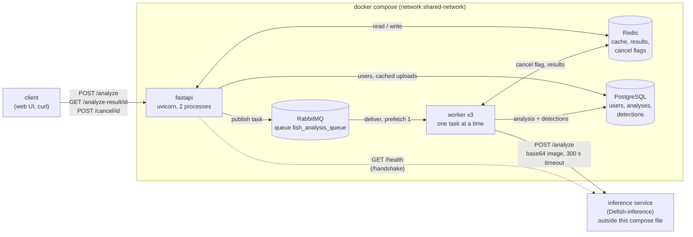
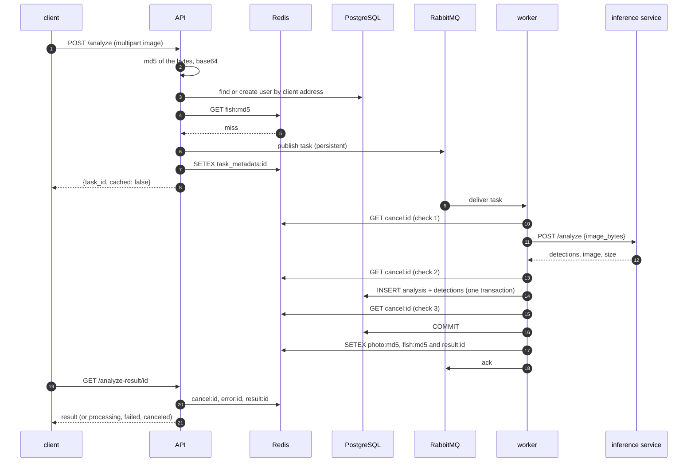
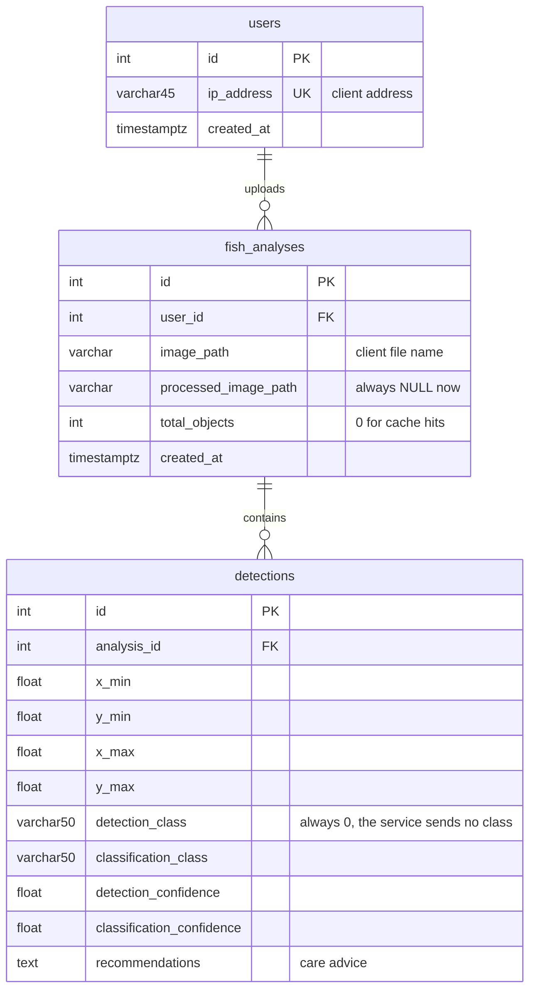

# Architecture

How the services fit together, what one analysis looks like on the wire, what is stored where, and what happens when a part fails.
Facts below were read from the code and, where it says *measured*, observed on the Docker stack described in [deployment.md](deployment.md)
(inference service replaced by the mock, see [examples/transcripts/](examples/transcripts/)).

Contents: [Components](#components) · [One analysis, step by step](#one-analysis-step-by-step) · [Cache hit and cancellation](#cache-hit-and-cancellation) ·
[Message format](#message-format) · [Redis keys](#redis-keys) · [Data model](#data-model) · [Timeouts and concurrency](#timeouts-and-concurrency) · [Failure modes](#failure-modes)

## Components

| Service | Image / process | Role | Limits in `docker-compose.yml` |
|---|---|---|---|
| `fastapi` | built from `Dockerfile`, `uvicorn main:app --workers 2` | HTTP API; publishes tasks, reads results; port 8000 in the container, `127.0.0.1:8001` on the host | 200 MB, 0.4 CPU |
| `worker` | same image, `python worker.py`, 3 replicas | consumes tasks, calls the inference service, writes results | 300 MB, 0.3 CPU each |
| `rabbitmq` | `rabbitmq:3.13-management-alpine` | task queue; the management UI port is not published | 300 MB, 0.5 CPU |
| `redis` | `redis:7-alpine`, `--appendonly yes --maxmemory 64mb --maxmemory-policy allkeys-lru` | image-hash cache, task results, errors, cancel flags | 200 MB, 0.2 CPU |
| `postgres` | `postgres:15-alpine` | users, analyses, detections | 300 MB, 0.3 CPU |

The inference service is not part of the compose file; `ML_SERVER_URL` points at it. The mock in `examples/` can be added as a sixth service.

## One analysis, step by step

1. **Upload.** The API reads the whole file into memory, hashes it (MD5, used as a cache key, not for security) and looks the client up by address (`X-Forwarded-For`, then `X-Real-IP`, then the socket address).
2. **Cache lookup.** A hit is answered at once (next section). A miss becomes a task.
3. **Publish.** The task carries the photo itself as base64, so workers need no shared disk. It is published to the durable queue `fish_analysis_queue` as a persistent message; the task id (a UUID) is generated here.
4. **Return.** The client gets the id immediately and polls `GET /analyze-result/{id}`. The endpoint answers in a fixed order: canceled, failed, result, otherwise `processing` (also for ids that were never issued).
5. **Work.** A worker takes one message at a time (`prefetch_count=1`). It calls the inference service, converts every detection (`bbox`, `det_confidence`, `class`, `class_confidence`, `uncertain`, `top3`) into the API format, adds the recommendation text per class and one summary for the whole photo.
6. **Persist.** Analysis row and detection rows are written in one transaction; the id of the analysis row comes from a `flush`, so a cancel noticed before the commit leaves nothing behind.
7. **Publish the result.** The worker stores the photo once as `photo:{md5}`, then `fish:{md5}` (what a later upload of the same photo hits) and `result:{id}` (what the client polls), then acknowledges the message. The last two hold the analysis only (about 6 KB each) and the photo's hash; the API adds the photo when it answers.

## Cache hit and cancellation

A second upload of the same bytes never reaches the queue: the API answers `200` with the finished analysis (no `task_id`), and still logs the upload as a new `fish_analyses` row with `total_objects = 0` and the client's file name. The cache is keyed by the bytes only; the file name does not matter.

`POST /cancel/{id}` only sets `cancel:{id}` (one hour) and does not check that the task exists. The flag is read by the worker three times: before the call to the inference service, after it, and after the rows were written. The running inference call is not aborted; a canceled task simply produces no result, no database rows and no cache entry. The endpoint that serves results checks the flag first, so a canceled task reports `canceled` even if a result was stored a moment earlier.

## Message format

One JSON object per message (`rabbitmq/schemas.py`, `RabbitMQTask`):

| Field | Meaning |
|---|---|
| `task_id` | UUID generated by the API |
| `image_bytes` | the uploaded file, base64 |
| `image_path`, `filename` | the client's file name (until the fixes described in [design-decisions.md](design-decisions.md#7-the-photo-is-not-written-to-disk-or-the-database) `image_path` was a temporary path on the API host) |
| `content_type` | from the upload, `image/jpeg` when missing |
| `image_hash` | MD5 of the bytes |
| `user_id` | row in `users` |
| `created_at`, `timeout` | submission time; 300 (the worker uses the constant, not this field) |
| `result_queue` | empty; kept so that the worker still understands messages from an older API |

Messages are acknowledged after processing, whether the analysis succeeded or failed: a failed task is **not retried**. Only a message that cannot be parsed or validated is rejected (`nack`, no requeue, no dead-letter queue), which drops it.

## Redis keys

| Key | Written by | Read by | Lifetime | Content |
|---|---|---|---|---|
| `photo:{md5}` | worker | API when it answers | `CACHE_SAVING_TIME`, default 3600 s | the photo as base64 JPEG, one copy per distinct photo (4.2 MB for a 3 MB photo) |
| `fish:{md5}` | worker | API on upload, `/cache-stats`, `/clear-cache` | `CACHE_SAVING_TIME`, default 3600 s | finished analysis without the photo, plus `image_hash` and `cached_at` |
| `result:{task_id}` | worker | API on poll | 3600 s | finished analysis without the photo, plus `image_hash` |
| `error:{task_id}` | worker | API on poll | 3600 s | short text: `ML service unavailable`, `ML service timed out`, `ML service returned HTTP 500`, `Internal error` |
| `cancel:{task_id}` | API | API on poll, worker (three times) | 3600 s | `1` |
| `task_metadata:{task_id}` | API | nobody | 3600 s | user id, file name, cache key (diagnostic only) |

Redis runs with a 64 MB limit and `allkeys-lru`, so **any** key can be evicted, results and cancel flags included (LRU does not distinguish a 6 KB result from a 4 MB photo); see [Limitations](../README.md#limitations). A result whose photo is gone is still delivered with `original_image` `null`; a cached analysis without its photo is analysed again.
If Redis is unreachable the API treats every lookup as a miss (`utils/cache.py` swallows the error).

## Data model

Verified on the running database (`\d` output in [examples/transcripts/stack-checks.txt](examples/transcripts/stack-checks.txt)). Coordinates are pixels of the original image.
`uncertain` and `top3` are in the API response but have no column. Tables are created by `prestart.py` (`create_all`); Alembic holds a baseline revision only, see [deployment.md](deployment.md#database-schema-and-alembic).

## Timeouts and concurrency

| What | Value | Where |
|---|---|---|
| call from a worker to the inference service | 300 s | `rabbitmq/schemas.py` `ML_ANALYZE_TIMEOUT`; the inference service has its own limit (`REQ_TIMEOUT`), kept equal |
| `/handshake` call to the inference service | 5 s | `main.py` |
| task and result keys in Redis | 3600 s | `config.py` `TASK_KEY_TTL` |
| analyses running at the same time | at most 3 | 3 worker replicas, one task each |
| API processes | 2 | `uvicorn --workers 2`; each keeps one RabbitMQ connection and one Redis connection pool |
| worker reconnect delay | 5 s (broker closed the connection), 10 s (connection error, broker unreachable) | `worker.py` |

## Failure modes

"Measured" means observed on the Docker stack; "unit test" means covered by `tests/` with fakes; "code" means read from the source and not exercised.

| Failure | What happens | Evidence |
|---|---|---|
| inference service returns an error or is unreachable | the task ends with `error:{id}` = a short text, no rows are written, the message is acknowledged; the client sees `failed` | measured (mock `broken` file name), unit test |
| inference service answers after 300 s | `requests` times out: `ML service timed out` | unit test |
| the client cancels | `canceled`; nothing stored; the inference call still runs to its end and keeps the worker busy | measured (`slow` mock), unit test |
| RabbitMQ restarts | workers log the drop, reconnect (15 s in that run) and carry on; a task submitted afterwards is processed | measured (`docker compose restart rabbitmq`); before the fixes the three workers exited and stayed down |
| worker receives SIGTERM during a task | the task is finished and acknowledged, then the worker exits with status 0 | measured (8 s task, `docker compose stop`, 6 s) |
| worker is killed mid-task | the unacknowledged message is redelivered to another worker; a second set of rows may be written | code (RabbitMQ semantics), not exercised |
| RabbitMQ is down when the client uploads | `500 Task queue error` | unit test with a failing queue; not exercised against a stopped broker |
| Redis is down | the API sees misses and can neither store cancel flags nor read results; a worker cannot store a result or an error, so the client keeps seeing `processing` | code, not exercised |
| PostgreSQL is down | upload answers `500 Internal server error`; a worker records `Internal error` | code, not exercised |
| Redis evicts a result before the client polls | the client sees `processing` forever | measured with large photos and a late-polling client, see [Limitations](../README.md#limitations) |
| Redis evicts only the photo | the result is delivered with `original_image` `null`; a repeated upload of the photo is analysed again | unit test |
| several large uploads at once (10 x 3 MB) | a process in the API container is killed by the 200 MB memory limit; uploads that were in flight fail (18, 9 and 0 of 50 in three runs); the container itself keeps running (`RestartCount` 0) | measured, [stress-large-photos.txt](examples/transcripts/stress-large-photos.txt) |
